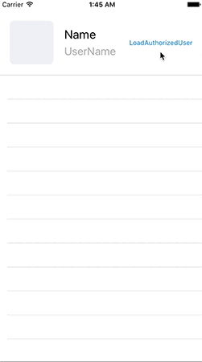
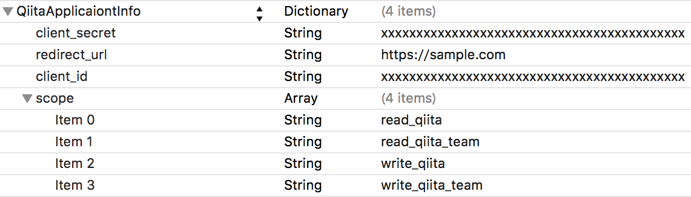

# QiitaApiClient

[](https://travis-ci.org/szk-atmosphere/QiitaApiClient)
[](http://cocoapods.org/pods/QiitaApiClient)
[](http://cocoapods.org/pods/QiitaApiClient)
[](http://cocoapods.org/pods/QiitaApiClient)

API client for [Qiita](http://qiita.com/).



## Features

- Show AuthorizeViewController automatically if you not authorized.
- Request with Associated Values

## Usage

```swift
//Search items sample
let method: QiitaHttpMethod = .Get(.Items(page: 1, perPage: 100, query: [.Word("MisterFusion")]))
QiitaApiClient.sharedClient.request(method) { (response: QiitaResponse<[QiitaItem]>) in
    switch response.result {
    case .Success(let models):
        print(response.totalCount)
        models.forEach { print($0.title) }
    case .Failure(let error):
        print(error)
    }
}

//Fetch authenticated user sample
let method: QiitaHttpMethod = .Get(.AuthenticatedUserItems(page: 1, perPage: 100))
QiitaApiClient.sharedClient.request(method) { (response: QiitaResponse<QiitaAuthenticatedUser>) in
    switch response.result {
    case .Success(let model):
        print(model.name)
    case .Failure(let error):
        print(error)
    }
}
```

## Configration

If you have created new [Qiita application](https://qiita.com/settings/applications/new), you can get `Client ID` and `Client Secret`.

You have to add `client_id`, `client_secret`, `redirect_url`, `scope` in your [Info.plist](./QiitaApiClientSample/QiitaApiClientSample/Info.plist) like this.



```
<key>QiitaApplicaiontInfo</key>
<dict>
	<key>client_secret</key>
	<string>xxxxxxxxxxxxxxYourClientSecretxxxxxxxxxxxxx</string>
	<key>redirect_url</key>
	<string>https://sample.com</string>
	<key>client_id</key>
	<string>xxxxxxxxxxxxxxxxYourClientIdxxxxxxxxxxxxxxx</string>
	<key>scope</key>
	<array>
		<string>read_qiita</string>
		<string>read_qiita_team</string>
		<string>write_qiita</string>
		<string>write_qiita_team</string>
	</array>
</dict>
```

## Installation

QiitaApiClient is available through [CocoaPods](http://cocoapods.org). To install
it, simply add the following line to your Podfile:

```ruby
pod "QiitaApiClient"

```
## API

It is based on [Qiita API v2 Docs](http://qiita.com/api/v2/docs).

| Original Path                               | Method | Associated Values                                                                                                   | Response               |
|:--------------------------------------------|:-------|:--------------------------------------------------------------------------------------------------------------------|:-----------------------|
| /api/v2/oauth/authorize                     | Get    | QauthAuthorize(clientId: String, scope: String, state: String?)                                                     | --                     |
| /api/v2/items/:item_id/likes                | Get    | ItemsItemIdLikes(itemId: Int)                                                                                       | [QiitaLike]            |
| /api/v2/access_tokens                       | Post   | AccessTokens(clientId: String, clientSecret: String, code: String)                                                  | QiitaAccessToken       |
| /api/v2/access_tokens/:access_token         | Delete | AccessTokens(accessToken: String)                                                                                   | --                     |
| /api/v2/comments/:comment_id                | Delete | CommentsCommentId(commentId: String)                                                                                | --                     |
| /api/v2/comments/:comment_id                | Get    | CommentsCommentId(commentId: String)                                                                                | QiitaComment           |
| /api/v2/comments/:comment_id                | Patch  | CommentsCommentId(commentId: String, body: String)                                                                  | QiitaComment           |
| /api/v2/comments/:comment_id/thank          | Delete | CommentsCommentIdThank(commentId: String)                                                                           | QiitaComment           |
| /api/v2/comments/:comment_id/thank          | Put    | CommentsCommentIdThank(commentId: String)                                                                           | QiitaComment           |
| /api/v2/items/:item_id/comments             | Get    | ItemsItemIdComments(itemId: String)                                                                                 | [QiitaComment]         |
| /api/v2/items/:item_id/comments             | Post   | ItemsItemIdComments(itemId: String, body: String)                                                                   | QiitaComment           |
| /api/v2/items/:item_id/taggings             | Post   | ItemsItemIdTaggings(itemId: String, name: String, versions: [String])                                               | QiitaTagging           |
| /api/v2/items/:item_id/taggings/:tagging_id | Delete | ItemsItemIdTaggingsTaggingId(itemId: String, taggingId: Int)                                                        | --                     |
| /api/v2/tags                                | Get    | Tags(page: Int, perPage: Int, sort: Sort)                                                                           | [QiitaTag]             |
| /api/v2/tags/:tag_id                        | Get    | TagsTagId(tagId: Int)                                                                                               | QiitaTag               |
| /api/v2/users/:user_id/following_tags       | Get    | UsersUserIdFollowingTags(userId: String, page: Int, perPage: Int)                                                   | QiitaTag               |
| /api/v2/tags/:tag_id/following              | Delete | TagsTagIdFollowing(tagId: Int)                                                                                      | --                     |
| /api/v2/tags/:tag_id/following              | Get    | TagsTagIdFollowing(tagId: Int)                                                                                      | QiitaTag               |
| /api/v2/tags/:tag_id/following              | Put    | TagsTagIdFollowing(tagId: Int)                                                                                      | --                     |
| /api/v2/teams                               | Get    | Teams                                                                                                               | [QiitaTeam]            |
| /api/v2/templates                           | Get    | Templates(page: Int, perPage: Int)                                                                                  | [QiitaTemplate]        |
| /api/v2/templates/:template_id              | Delete | TemplatesTemplateId(templateId: Int)                                                                                | --                     |
| /api/v2/templates/:template_id              | Get    | TemplatesTemplateId(templateId: Int)                                                                                | QiitaTemplate          |
| /api/v2/templates                           | Post   | Templates(body: String, name: String, tags: [QiitaTagging], title: String)                                          | QiitaTemplate          |
| /api/v2/templates/:template_id              | Patch  | TemplatesTemplateId(templateId: Int, body: String, name: String, tags: [QiitaTagging], title: String)               | QiitaTemplate          |
| /api/v2/projects                            | Get    | Projects(page: Int, perPage: Int)                                                                                   | [QiitaProject]         |
| /api/v2/projects                            | Post   | Projects(archived: Bool, body: String, name: String, tags: [QiitaTagging])                                          | QiitaProject           |
| /api/v2/projects/:project_id                | Delete | ProjectsProjectId(progectId: Int)                                                                                   | --                     |
| /api/v2/projects/:project_id                | Get    | ProjectsProjectId(progectId: Int)                                                                                   | QiitaProject           |
| /api/v2/projects/:project_id                | Patch  | ProjectsProjectId(progectId: Int, archived: Bool, body: String, name: String, tags: [QiitaTagging])                 | QiitaProject           |
| /api/v2/items/:item_id/stockers             | Get    | ItemsItemIdStockers(itemId: String, page: Int, perPage: Int)                                                        | [QiitaUser]            |
| /api/v2/users                               | Get    | Users(page: Int, perPage: Int)                                                                                      | [QiitaUser]            |
| /api/v2/users/:user_id                      | Get    | UsersUserId(userId: String)                                                                                         | QiitaUser              |
| /api/v2/users/:user_id/followees            | Get    | UsersUserIdFollowees(userId: String, page: Int, perPage: Int)                                                       | [QiitaUser]            |
| /api/v2/users/:user_id/followers            | Get    | UsersUserIdFollowers(uesrId: String, page: Int, perPage: Int)                                                       | [QiitaUser]            |
| /api/v2/users/:user_id/following            | Delete | UsersUserIdFollowing(userId: String)                                                                                | --                     |
| /api/v2/users/:user_id/following            | Get    | UsersUserIdFollowing(userId: String)                                                                                | QiitaUser              |
| /api/v2/users/:user_id/following            | Put    | UsersUserIdFollowing(userId: String)                                                                                | --                     |
| /api/v2/expanded_templates                  | Post   | ExpandedTemplates(body: String, tags: [QiitaTagging], title: String)                                                | QiitaExpandedTemplate  |
| /api/v2/authenticated_user/items            | Get    | AuthenticatedUserItems(page: Int, perPage: Int)                                                                     | [QiitaItem]            |
| /api/v2/items                               | Get    | Items(page: Int, perPage: Int, query: [SearchQuery])                                                                | [QiitaItem]            |
| /api/v2/items                               | Post   | Items(body: String, coediting: Bool, gist: Bool, `private`: Bool, tags: [QiitaTagging], title: String, tweet: Bool) | QiitaItem              |
| /api/v2/items/:item_id                      | Delete | ItemsItemId(itemId: String)                                                                                         | QiitaItem              |
| /api/v2/items/:item_id                      | Get    | ItemsItemId(itemId: String)                                                                                         | QiitaItem              |
| /api/v2/items/:item_id                      | Patch  | ItemsItemId(itemId: String, body: String, coediting: Bool, `private`: Bool, tags: [QiitaTagging], title: String)    | QiitaItem              |
| /api/v2/items/:item_id/like                 | Delete | ItemsItemIdLike(itemId: String)                                                                                     | --                     |
| /api/v2/items/:item_id/like                 | Put    | ItemsItemIdLike(itemId: String)                                                                                     | --                     |
| /api/v2/items/:item_id/stock                | Delete | ItemsItemIdStock(itemId: String)                                                                                    | --                     |
| /api/v2/items/:item_id/stock                | Get    | ItemsItemIdStock(itemId: String)                                                                                    | --                     |
| /api/v2/items/:item_id/like                 | Get    | ItemsItemIdLike(itemId: String)                                                                                     | --                     |
| /api/v2/items/:item_id/stock                | Put    | ItemsItemIdStock(itemId: String)                                                                                    | --                     |
| /api/v2/tags/:tag_id/items                  | Get    | TagsTagIdItems(tagId: Int, page: Int, perPage: Int)                                                                 | [QiitaItem]            |
| /api/v2/users/:user_id/items                | Get    | UsersUserIdItems(userId: String, page: Int, perPage: Int)                                                           | [QiitaItem]            |
| /api/v2/users/:user_id/stocks               | Get    | UsersUserIdStocks(userId: String, page: Int, perPage: Int)                                                          | [QiitaItem]            |
| /api/v2/authenticated_user                  | Get    | AuthenticatedUser                                                                                                   | QiitaAuthenticatedUser |

## Requirements

- Xcode 7.0 or greater
- iOS 8.0 or greater
- WebKit
- [MisterFusion](https://github.com/marty-suzuki/MisterFusion)

## Author

marty-suzuki, s1180183@gmail.com

## License

QiitaApiClient is available under the MIT license. See the LICENSE file for more info.
